# Git Advanced

## 0. 사전 준비

1. Github 에 원격 Repository 를 생성한다.
2. git clone 을 통해 Local Repository 로 복사한다.

## 1. 복습

- Git 은 파일 관리를 크게 2가지 구분한다

1. Untracked
	- git 이 추적하지 않은 파일
	- 윈도우 기준으로 폴더 내부에 `.git` 폴더가 존재하면 자동으로 추적된다
  - `.gitignore` 사용을 통해 폴더나 파일을 Untracked 상태로 만들 수 있다

2. Tracked
  - git 이 변화를 감지하고 있는 상태
  - Tracked 상태는 아래 3가지로 나눌 수 있다.
    - Unmodified
      - 수정하지 않은 파일 ( == 최신 파일 )
      - Local Git 에 올라간 파일과 비교하였을 때, 수정되지 않은 상태
    - Modified (vscode : Changes)
      - 수정한 파일
    - Staged (vscode : Staged Changes)
      - commit 을 하기 위해 기다리는 상태
      - 이 영역을 __Staging Area__ 라고 부름

- 명령어 정리 : Local Git Repository
```
현재 디렉토리를 Git 작업 디렉토리로 초기화 : git init

Unmodified    ->    Modified          : 파일 수정

Modified      ->    Staged            : git add

Staged        ->    Local Repository  : git commit

현재 Git 파일 상태 확인                : git status

Git 작업(Commit) 내역 확인             : git log
  - commit id, 작성자, 날짜, commit message 확인 가능
  - 종료 명령어 : q
```

- 명령어 정리 : Remote Git Repository
```
1. 최초 작업 시

Local Repo     ->   Remote Repo       : git remote add

Remote Repo    ->   Local Repo        : git clone

----------------------------------------------------

2. 진행 중일 때

Local Repo     ->   Remote Repo       : git push

Remote Repo    ->   Local Repo        : git pull
```

---

## 2. 작업 단계 되돌리기 ( 작업 취소 )

취소는 크게 2가지로 나뉜다.

### 1. 직전 작업 취소

#### Working Directory 작업 취소
  - Modified 상태의 파일을 직전 Commit 으로 되돌림
  - `$ git restore <파일명>`
  - 이미 버전 관리가 되고 있는 파일만 되돌리기 가능
  - 되돌린 내용은 복원할 수 없으니 주의해야 함

- 파일 수정 후
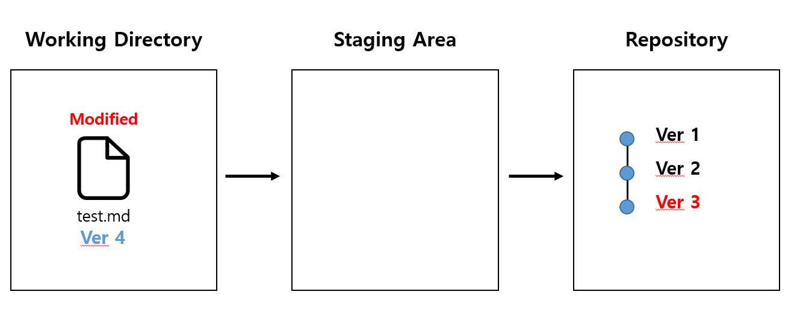

- git restore 후
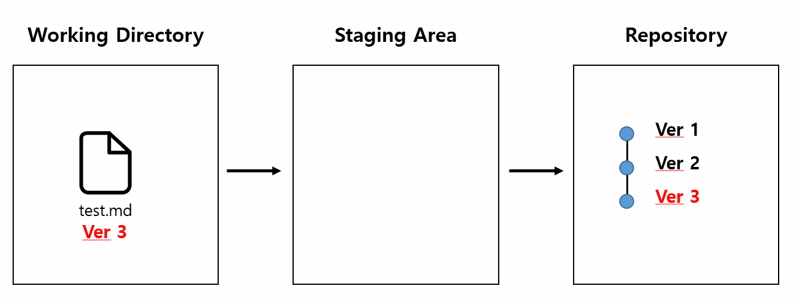

<br/>

#### Staging Area 작업 취소
  - Staged 상태의 파일을 Modified 상태로 되돌림 ( add 취소 )
  - root-commit 여부에 따라 두 가지로 나뉨
    - root-commit : 이전에 commit 을 한 적이 있는 파일이면 True
    - root-commit이 없는 경우 : `$git rm --cached <파일명>`

    - 새로운 파일 생성 -> add
    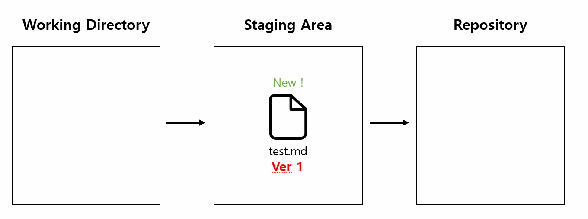

    - add 취소
    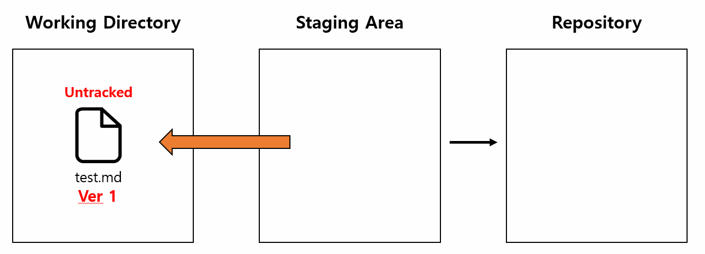image.png

    - root-commit이 있는 경우 : `$git restore --staged <파일명>`

    - 새로운 파일 생성 -> add
    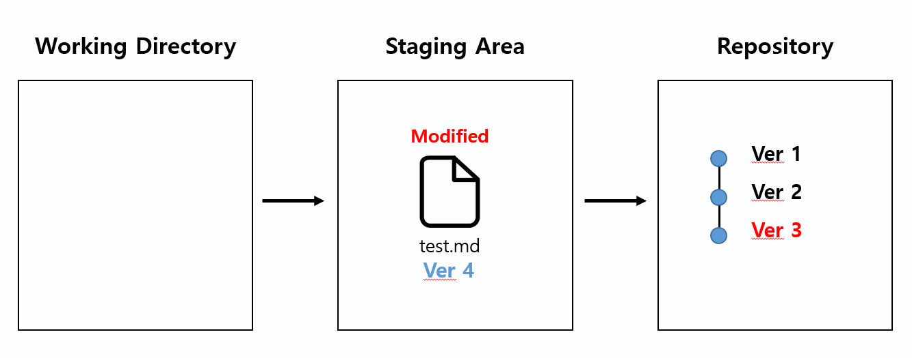

    - add 취소
    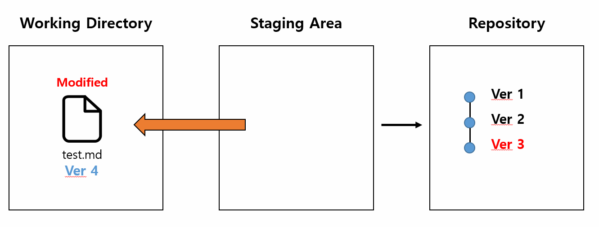

#### Repository 작업 취소
  - Commit 을 완료한 파일을 Staging Area 로 되돌리기 ( commit 취소 )
  - 명령어 : `$ git commit --amend`
  - Staging Area 에 다른 파일이 올라와 있는가에 따라서 두 가지로 나뉨
    - Staging Area에 새로 올라온 내용이 없다면 : __직전 Commit 의 메세지만 수정__

    - commit --amend 명령어 입력 전
    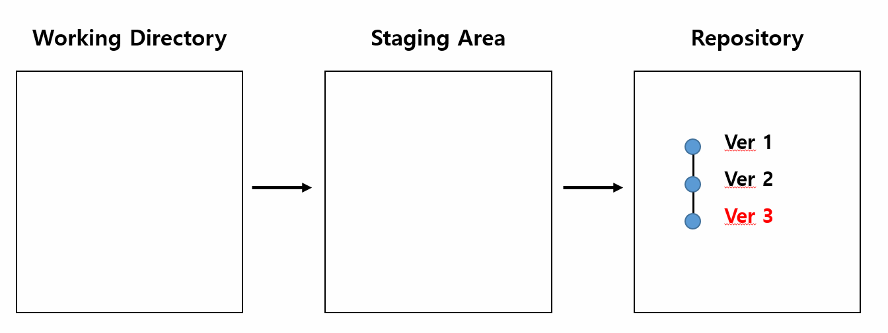

    - commit --amend 명령어 입력 후
    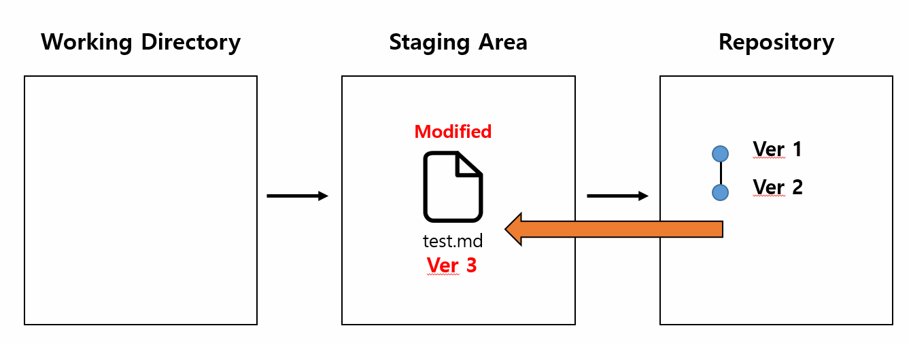

    - 결과
    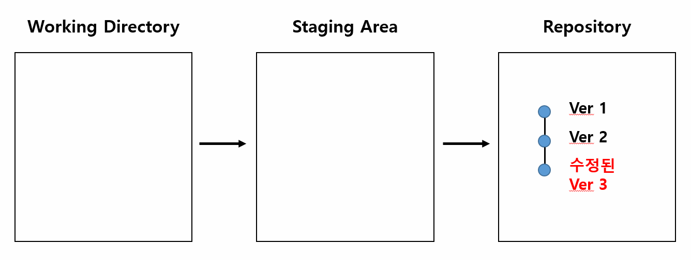

    - Staging Area에 새로 올라온 내용이 있다면 : __직전 Commit 을 새로운 Commit 으로 덮어쓰기__
      - 이 때, Staging Area 의 모든 내용이 Commit 에 포함된다

    - commit --amend 명령어 입력 전
    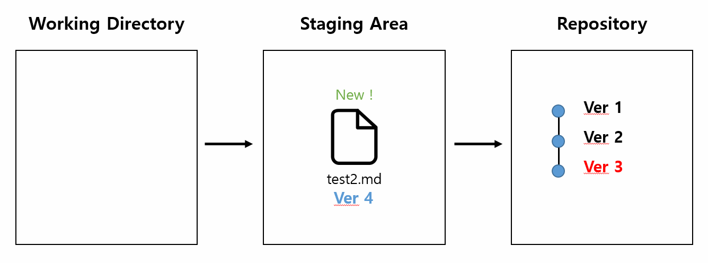

    - commit --amend 명령어 입력 후
    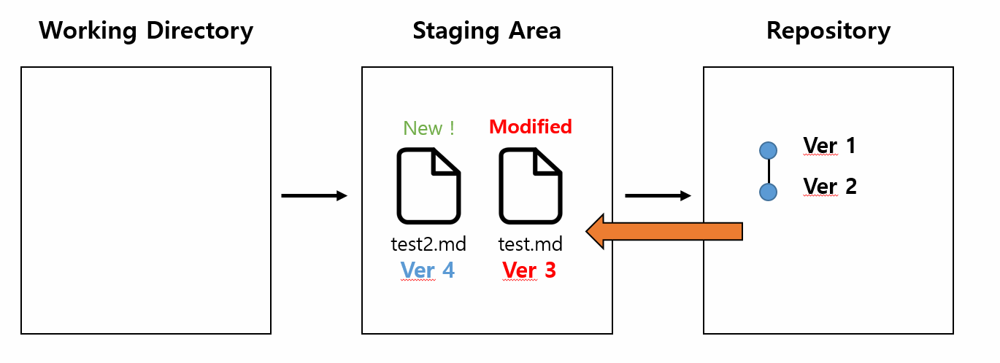

    - 결과
    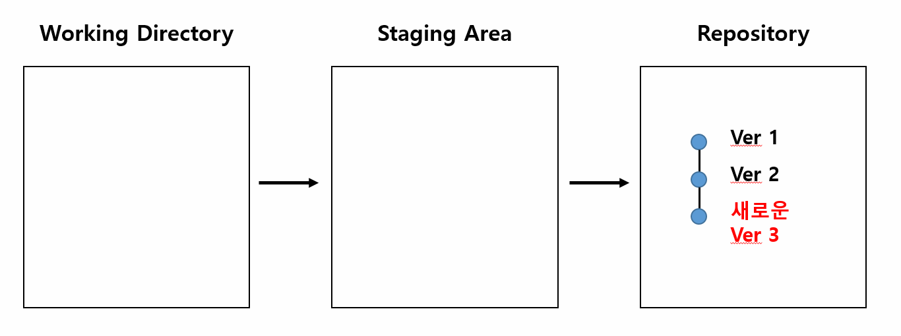

  - Commit 메세지 수정을 위해 Vim 편집기가 열림
    - 입력 모드(i) : 문서 편집 가능
    - 명령 모드(esc)
      - 명령 모드는 `:` 과 함께 사용한 다.
      - 저장 후 종료 (:wq)
      - 강제 종료 (:q!)
        - 리눅스에서 특정 동작을 강제로 수행하게 하는 것 : `!`

### 2. 과거 작업으로 돌아가기

#### Reset

- 프로젝트를 특정 Commit(버전) 상태로 되돌림
- 특정 Commit으로 되돌아 갔을 때, __해당 Commit 이후 쌓았던 Commit 들은 전부 사라짐__
- 명령어 : `$ git reset [옵션] <Commit_id>`
  - 옵션1. `--soft`
    - 해당 Commit 으로 되돌아감
    - 되돌아간 Commit 이후 파일들은 Staging Area 로 돌려놓음
  - 옵션2. `--mixed`
    - 해당 Commit 으로 되돌아감
    - 되돌아간 Commit 이후 파일들은 Working Directory 로 돌려놓음
    - git reset 옵션의 기본값
  - 옵션3. `--hard`
    - 해당 Commit 으로 되돌아감
    - 되돌아간 Commit 이후 파일들은 Working Directory 에서 삭제
      - 사용 시 주의하기 !

#### Revert

- 이전 Commit 을 취소하는 역할
- reset 은 Commit 내역을 삭제하지만, revert 는 삭제했다는 새로운 Commit 을 생성함
- 명령어 : `$ git revert <Commit_id>`
  - `$ git reset <Commit_id>` : Commit_id 로 프로젝트를 되돌린다 라는 뜻
  - `$ git revert <Commit_id>` : Commit_id 에 반영된 내용을 취소한다 라는 뜻
  - 여러 내역 revert : `$ git revert <start_id>..<end_id>`
    - 역순으로 하나씩 Commit Revert 가능

## 3. git branch

- 브랜치의 조회, 생성, 삭제와 관련된 명령어

- 조회
  - `$ git branch` : Local Repo 의 브랜치 목록 확인
  - `$ git branch -r` : Remote Repo 의 브랜치 목록 확인
- 생성
  - `$ git branch <브랜치명>` : 새로운 브랜치 생성
  - `$ git branch <브랜치명> <Commit_id>` : 특정 Commit 기준으로 브랜치 생성
- 삭제
  - `$ git branch -d <브랜치명>` : 병합된 브랜치 삭제 가능
  - `$ git branch -D <브랜치명>` : 강제로 브랜치 삭제

### git switch

- 현재 브랜치에서 다른 브랜치로 __HEAD__ 를 이동하는 명령어
  - `HEAD` : 현재 브랜치의 최신 Commit 을 가리킴

- 명령어
  - `$ git switch <브랜치명>` : 다른 브랜치로 이동
  - `$ git switch -c <브랜치명>` : 브랜치 새로 생성 후 이동
  - `$ git switch -c <브랜치명> <Commit_id>` : 특정 Commit 기준으로 브랜치 생성 후 이동

### git merge

- 분기된 브랜츠들을 하나로 합치는 명령어
- 명령어 : `$ git merge <합치고 싶은 브랜치 명>`
  - __병합 전 브랜치를 합치고자 하는 브랜치로 swtich 해야 한다__
    - 예를 들어, hotfix -> master 로 병합한다고 하면, HEAD 가 master 브랜치를 가리키고 있어야 한다.

- Merge 에는 세 종류가 존재한다.

#### 1. Fast-Forward
  - 브랜치가 가리키는 커밋을 앞으로 이동시키는 방법
  - 주로 hotfix 처럼 master 브랜치 변동 없이, 추가 브랜치에서만 작업이 이루어 졌을 경우 발생

  - Merge 전
  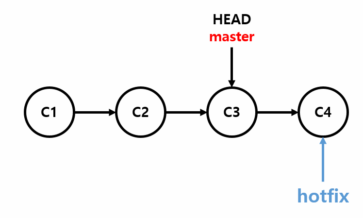

  - Merge 후
  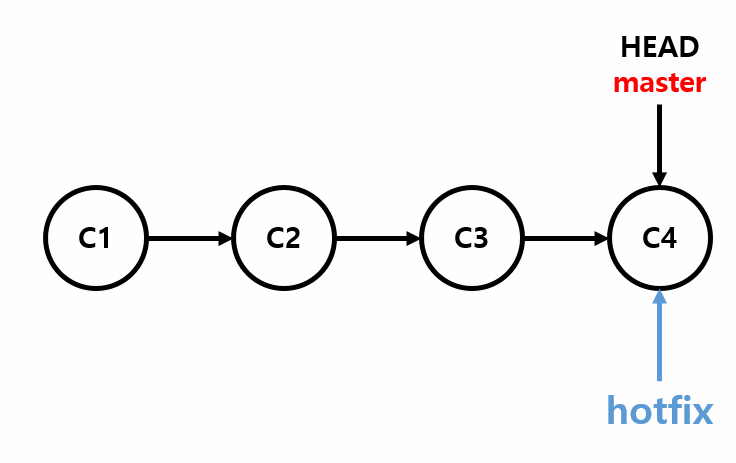

#### 2. 3-way Merge
  - 특정 시점으로 부터 파생된 __두 브랜치가 모두 수정되었을 경우__

  - Merge 전
  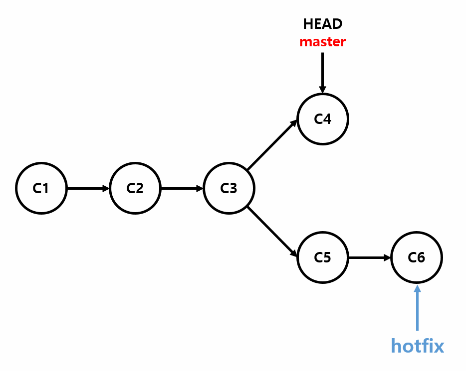

  - 각 브랜치의 Commit 과 공통 조상 하나를 사용하여 병합을 진행함
  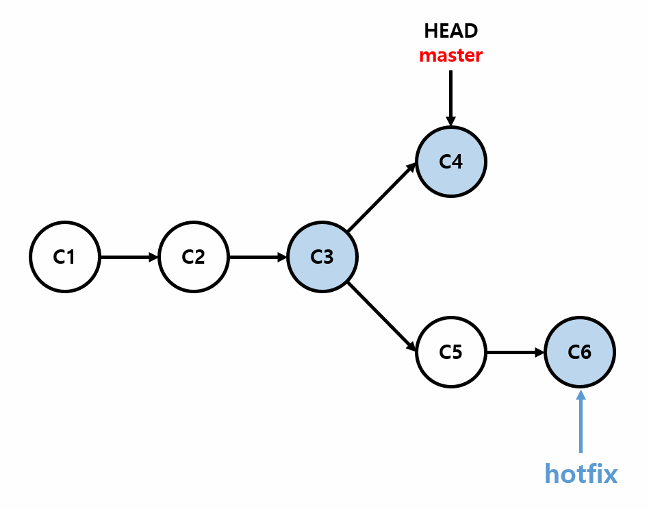

  - Merge 후
  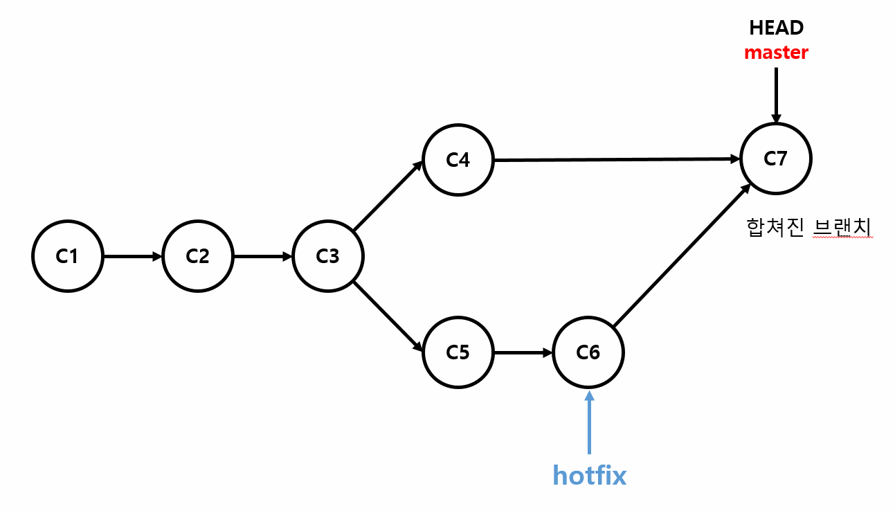

#### 3. Merge Confilct

- 두 브랜치에서 같은 부분(보통 파일)을 수정한 경우 발생
- Git 이 어느 브랜치의 내용으로 작성해야 하는 지 판단하지 못함
- 이를 작성자가 직접 해결해주어야 함

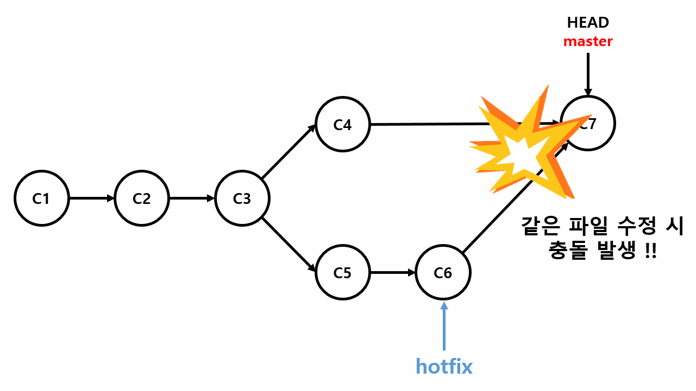

- 아래 사진에서, 윗 부분은 HEAD(현재 브랜치) 의 내용이며 아랫 부분은 병합을 원하는 브랜치의 부분이다.
- 둘 모두의 내용을 보여 준 후 사용자가 수정할 수 있도록 제공한다.
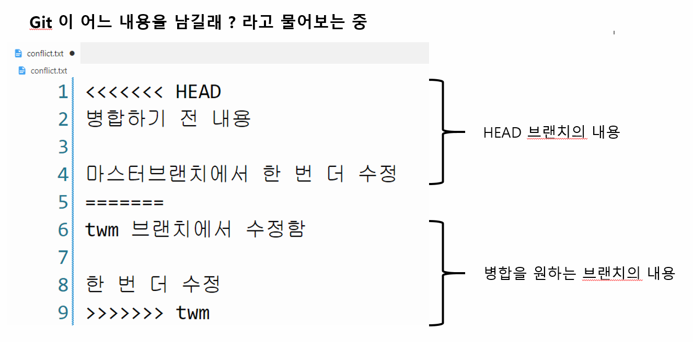

- 충돌이 발생한 파일을 `수정 -> ADD -> COMMIT` 하고 나면 에러가 해결된다.
- HEAD 브랜치의 경우 수정한 파일 내용이 반영되며, 병합을 원하는 브랜치는 원래 내용이 그대로 남아있다.

### 추가 내용

- Fork & Pull Request
  - 하나의 Repo 를 생성하고, 팀원들이 Fork 를 통해 복사한다.
  - 각자 Fork Repo 를 clone 후 branch 를 생성하여 push 한다.
    - 이 때, Fork Repo 에 생성한 branch 내용이 반영된다.
  - Fork Repo 에서 원본 Repo 로 Pull Request 를 보낸다.

### Git 브랜치 전략

- 브랜치를 어떻게 잘 만들지에 대한 생성 규칙 혹은 방법론
- git-flow, github-flow, gitlab-flow 가 존재한다.
- 지금 당장 완벽하게 이해하는 것은 불가능하니, 존재 여부만 학습해놓고 나중에 큰 프로젝트를 보거나 회사의 브랜치 전략을 보게 되면 구글링을 통해 참고하면 좋다.
